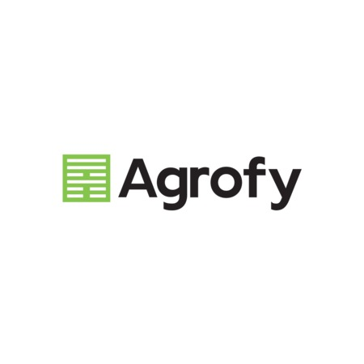
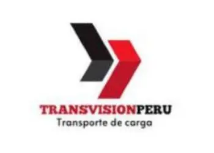
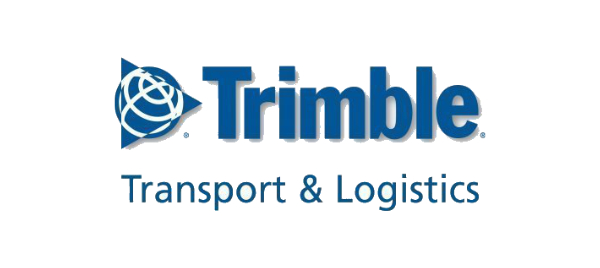

# Capítulo II: Requirements Elicitation & Analysis

## 2.1. Competidores

En esta sección se identifican y describen los principales competidores de AgroFlet en el mercado de soluciones digitales para la gestión y el monitoreo logístico del transporte de carga, con especial atención a aquellos que operan en el sector agrícola o en economías emergentes con características similares a la peruana.

Para la identificación de competidores, el equipo definió el criterio de búsqueda en torno a plataformas digitales que ofrezcan, total o parcialmente, alguna de las siguientes capacidades: rastreo de unidades de carga en tiempo real, gestión de flotas terrestres, seguimiento de envíos de carga agrícola o perecible, y/o registro de incidencias durante el trayecto. Se identificaron tres competidores con modelos de negocio digital parcialmente similares:

1. **Agrofy (Argentina/Brasil):** plataforma de marketplace y logística agroindustrial con módulos de trazabilidad de carga.
2. **Transvision (Perú):** sistema de rastreo satelital y gestión de flotas para empresas de transporte terrestre.
3. **Trimble Transportation (EE.UU. — presencia en LATAM):** plataforma integral de gestión de flotas y visibilidad de carga, con alcance en el mercado latinoamericano corporativo.

### 2.1.1. Análisis competitivo

**¿Por qué llevar a cabo este análisis?**
Buscamos entender en qué medida las soluciones existentes en el mercado peruano y latinoamericano resuelven la necesidad de visibilidad y trazabilidad logística en el transporte de alimentos agrícolas, y qué brechas siguen sin cubrir para los segmentos de medianos productores/acopiadores y compradores mayoristas en el Perú.

---

|  | **AgroFlet** | **Agrofy** | **Transvision** | **Trimble Transportation** |
|---|---|---|---|---|
| **Logo / Nombre** | AgroFlet |  Agrofy |  Transvision |  Trimble Transportation |
| **Perfil — Overview** | Startup peruana de monitoreo logístico especializada en el transporte terrestre de alimentos agrícolas perecibles a nivel nacional. Plataforma web con dashboard en tiempo casi real, registro de incidencias y gestión de historial de operaciones. | Plataforma argentina de marketplace agroindustrial que incorpora módulos de logística y trazabilidad de carga agrícola para el mercado sudamericano. | Empresa peruana de rastreo satelital GPS que ofrece soluciones de monitoreo de flotas terrestres para empresas de transporte general, con presencia en el mercado local. | Empresa estadounidense con soluciones enterprise de gestión de flotas y visibilidad de la cadena de suministro, con cobertura en América Latina a través de distribuidores. |
| **Ventaja competitiva — ¿Qué valor ofrece a los clientes?** | Plataforma web sectorial diseñada específicamente para el transporte de alimentos en el Perú. Combina monitoreo de flotas, registro de incidencias con impacto en tiempo de entrega, y gestión de historial de operaciones en una sola interfaz accesible. | Ecosistema de marketplace agroindustrial que integra la logística como un módulo adicional, facilitando la conexión entre productores, compradores y transportistas dentro de una misma plataforma transaccional. | Rastreo GPS en tiempo real de unidades de transporte con alertas configurables y reportes de recorrido para empresas con flotas medianas a grandes. | Gestión integral de flotas (TMS), visibilidad de la cadena de suministro, optimización de rutas y análisis avanzado de datos logísticos para grandes corporaciones. |
| **Perfil de Marketing — Mercado objetivo** | Medianos productores agrícolas, acopiadores y cooperativas del interior del Perú; compradores mayoristas y encargados de abastecimiento en Lima Metropolitana y capitales de región. | Productores agrícolas, agroindustrias, brokers y transportistas de Argentina, Brasil y otros mercados sudamericanos con enfoque en commodities agrícolas. | Empresas de transporte terrestre de carga general y minería en el Perú, con flotas de 5 a 200 unidades. Mercado corporativo medio-alto. | Grandes empresas de transporte, distribución y cadena de suministro a nivel corporativo en América Latina. No orientado a PyMEs ni al sector agrícola informal. |
| **Estrategias de marketing** | Marketing de contenido orientado al sector agro-logístico peruano, alianzas con cooperativas agrarias y asociaciones de transportistas, demostraciones en campo con usuarios de los segmentos objetivo. Modelo *freemium* con suscripción mensual escalonada. | Marketing digital en redes sociales especializadas en agro, participación en ferias agroindustriales internacionales, partnerships con agroindustrias y asociaciones de productores. | Ventas directas B2B, red de distribuidores regionales en el Perú, participación en eventos del sector transporte y logística. | Fuerza de ventas corporativa, eventos internacionales de logística (p.ej. Transexpo LATAM), alianzas con fabricantes de vehículos de carga. |
| **Perfil de Producto — Productos & Servicios** | Dashboard de monitoreo logístico en tiempo casi real; registro y visualización de incidencias en ruta; gestión de historial de operaciones con filtros avanzados; visualización geográfica de viajes activos en mapa interactivo; gestión de flotas y conductores; sistema de alertas y notificaciones. | Marketplace de insumos y commodities agrícolas; módulo de logística para cotización y contratación de fletes; trazabilidad básica de envíos; conexión entre oferta y demanda agroindustrial. | Rastreo GPS satelital en tiempo real; geocercas configurables; alertas de velocidad, paradas y desviaciones; reportes de recorrido y eficiencia de combustible; aplicación móvil para conductores. | TMS (Transportation Management System); visibilidad multimodal de la cadena de suministro; optimización de rutas; gestión de cumplimiento normativo; análisis de datos y Business Intelligence logístico. |
| **Precios & Costos** | Modelo de suscripción mensual escalonado por número de unidades registradas. Plan básico accesible para pequeñas flotas (1-5 unidades); plan estándar para flotas medianas (6-20 unidades); plan profesional para flotas grandes (21+ unidades). Precios orientados al poder adquisitivo del mercado peruano de medianas empresas. | Registro gratuito en el marketplace; comisiones por transacción logística; módulos premium de trazabilidad con costo adicional. Precios en USD, diseñados para el mercado argentino y brasileño. | Costo de instalación de hardware GPS por unidad + suscripción mensual por unidad. Requiere inversión inicial en dispositivos físicos. Precios en soles, accesibles para empresas medianas peruanas. | Licencias enterprise con costo elevado (cientos a miles de USD/mes). Requiere implementación y consultoría. Poco accesible para PyMEs o mercados informales. |
| **Canales de distribución — Web y/o Móvil** | Aplicación web responsive (desktop y mobile browser); landing page informativa con call-to-action hacia la plataforma. | Web y aplicación móvil nativa (iOS y Android). | Web y aplicación móvil nativa para conductores. Hardware GPS físico instalado en las unidades. | Web (plataforma enterprise); integración con sistemas ERP existentes del cliente. |

---

#### Análisis SWOT

**AgroFlet**

| | |
|---|---|
| **Fortalezas** | Diseño sectorial enfocado exclusivamente en el transporte de alimentos agrícolas en el Perú. Propuesta de diseño orientada a simplificar la gestión del transporte agrícola y reducir la complejidad de uso frente a soluciones empresariales más especializadas para dos segmentos objetivo bien definidos. Modelo de precios accesible para el perfil de mediana empresa peruana. Interfaz inclusiva adaptada a usuarios con distintos niveles de alfabetización digital. Stack tecnológico moderno y escalable (Vue.js + ASP.NET Core + MySQL). |
| **Debilidades** | Sin base de usuarios activos al momento del lanzamiento (*cold start problem*). Equipo de desarrollo pequeño con recursos limitados para escalamiento acelerado. Dependencia de la adopción voluntaria de tecnología en un sector con alta informalidad. Sin hardware GPS propio, lo que limita la actualización de ubicación en tiempo real estricto. |
| **Oportunidades** | Creciente demanda de trazabilidad digital en el sector agroalimentario peruano impulsada por requisitos de exportación y supermercados formales. Escasa competencia directa en el nicho de monitoreo logístico agrícola en el Perú. Potencial de integración con programas de formalización del MTC y MIDAGRI. Expansión potencial a otros países andinos con problemáticas logísticas similares (Bolivia, Ecuador). |
| **Amenazas** | Alta informalidad del sector transportista puede frenar la adopción. Empresas de rastreo GPS establecidas (como Transvision) podrían pivotar hacia el nicho agrícola. Resistencia al cambio tecnológico en segmentos de baja alfabetización digital. Volatilidad económica que puede reducir la disposición de pago de las PyMEs. |

**Agrofy**

| | |
|---|---|
| **Fortalezas** | Marca reconocida en el ecosistema agroindustrial latinoamericano. Ecosistema integrado de marketplace + logística que genera red de efectos. Base de usuarios activa en Argentina y Brasil. |
| **Debilidades** | No está adaptado al contexto logístico peruano (geografía, informalidad, corredores viales). Enfoque comercial en *marketplace* limita la profundidad del módulo logístico. Precios en USD no competitivos para el mercado peruano. |
| **Oportunidades** | Expansión a mercados andinos. Integración con plataformas de exportación agrícola. |
| **Amenazas** | Competencia de soluciones locales más adaptadas a contextos nacionales específicos. |

**Transvision**

| | |
|---|---|
| **Fortalezas** | Presencia establecida en el mercado peruano de rastreo GPS. Solución probada y confiable para gestión de flotas. Red de soporte técnico local. |
| **Debilidades** | Solución genérica no especializada en el sector agrícola. Requiere inversión en hardware GPS, aumentando la barrera de entrada. No ofrece gestión de incidencias ni registro de tipo de carga. |
| **Oportunidades** | Ampliar hacia el nicho de transporte agrícola con módulos especializados. |
| **Amenazas** | Startups especializadas como AgroFlet que ofrecen mayor valor sectorial a menor costo de adopción. |

**Trimble Transportation**

| | |
|---|---|
| **Fortalezas** | Solución enterprise con funcionalidades avanzadas de TMS y BI logístico. Presencia global y respaldo financiero sólido. Integraciones con ERP de grandes corporaciones. |
| **Debilidades** | Precio y complejidad inaccesibles para PyMEs y operadores informales. Sin adaptación al mercado peruano ni al sector agrícola. |
| **Oportunidades** | Mercado corporativo en crecimiento en logística de exportación en LATAM. |
| **Amenazas** | Soluciones de menor costo y mayor especialización sectorial que satisfacen necesidades similares a menor precio. |

### 2.1.2. Estrategias y tácticas frente a competidores

A partir del análisis competitivo y del SWOT realizado, el equipo de AgroFlet ha identificado las siguientes estrategias y tácticas para afrontar las fortalezas de los competidores y aprovechar sus debilidades, en el contexto de las oportunidades y amenazas identificadas:

**Estrategia 1: Diferenciación por especialización sectorial**
*Frente a:* Transvision (solución genérica) y Trimble (enfoque corporate).
*Táctica:* Posicionar AgroFlet como la única plataforma de monitoreo logístico diseñada específicamente para el transporte de alimentos agrícolas en el Perú. Desarrollar contenido de valor (guías, casos de éxito, reportes del sector) que demuestre el conocimiento profundo del dominio agroalimentario y que establezca a AgroFlet como referente técnico en el nicho.

**Estrategia 2: Accesibilidad de precio y adopción sin fricción**
*Frente a:* Transvision (requiere hardware GPS) y Trimble (licencias enterprise).
*Táctica:* Ofrecer un modelo de incorporación (*onboarding*) sin inversión en hardware, basado exclusivamente en la plataforma web y la app móvil del conductor para la actualización de ubicación. Diseñar un plan de suscripción básico de bajo costo que permita a pequeños transportistas probar la plataforma con mínimo riesgo económico. Implementar un período de prueba gratuito de 30 días para nuevos registros.

**Estrategia 3: Alianzas estratégicas con gremios y asociaciones del sector**
*Frente a:* Agrofy (sin red local en Perú) y Transvision (enfoque B2B directo).
*Táctica:* Establecer acuerdos de colaboración con asociaciones de productores agrícolas (como la Junta Nacional del Café, la Asociación de Productores de Papa del Perú), cooperativas de acopio y gremios de transportistas regionales. Estas alianzas permitirán acceder a bases de usuarios potenciales de forma masiva y con mayor credibilidad que la venta directa.

**Estrategia 4: Aprovechamiento de la brecha en el mercado formal-informal**
*Frente a:* Todos los competidores que se enfocan en el segmento corporativo formal.
*Táctica:* Diseñar una experiencia de usuario altamente simplificada, con soporte en español, tutoriales en video cortos y atención al cliente vía WhatsApp, que reduzca la resistencia tecnológica de los segmentos con menor alfabetización digital. Complementar con un módulo de digitalización básica de guías de remisión que genere valor adicional inmediato para el transportista informal en proceso de formalización.

**Estrategia 5: Construcción de red de efectos mediante el comprador como ancla**
*Frente a:* Soluciones centradas únicamente en el transportista.
*Táctica:* Ofrecer acceso gratuito a la plataforma para el segmento comprador mayorista (como usuario receptor de envíos), de modo que la presión de sus proveedores de transporte para adoptar AgroFlet crezca orgánicamente. Esta dinámica de *pull* desde el comprador reduce el costo de adquisición de clientes en el segmento transportista y acelera la adopción.

## 2.2. Entrevistas

El proceso de investigación cualitativa de AgroFlet se estructura en torno a entrevistas semiestructuradas con representantes reales de los dos segmentos objetivo identificados. El objetivo de estas entrevistas es recolectar información primaria sobre los flujos de trabajo actuales, los puntos de dolor experimentados, las herramientas utilizadas y las expectativas frente a una solución digital de monitoreo logístico.

Las entrevistas se realizaron de manera individual, en formato presencial o videollamada, con una duración aproximada de entre 30 y 45 minutos por sesión. Cada entrevista fue grabada en video (con el consentimiento explícito del entrevistado) y posteriormente editada para conformar el video de evidencia de entrevistas de *needfinding*.

### 2.2.1. Diseño de entrevistas

El diseño de las guías de entrevista siguió las mejores prácticas para entrevistas de *needfinding* en diseño de experiencia de usuario (Portigal, 2013; Goodman et al., 2012). Las preguntas fueron formuladas en lenguaje abierto para evitar sesgar las respuestas del entrevistado, priorizando la descripción de comportamientos reales (*what people do*) sobre opiniones o intenciones abstractas (*what people say they would do*).

La guía de entrevista fue estructurada en tres bloques: (1) preguntas de apertura y calentamiento para establecer rapport y recolectar el perfil demográfico del entrevistado; (2) preguntas principales orientadas a explorar los flujos de trabajo actuales, los pain points y las herramientas utilizadas; y (3) preguntas de cierre orientadas a explorar la receptividad frente a soluciones digitales y la disposición de pago.

---

#### Guía de Entrevista — Segmento 1: Medianos Productores Agrícolas y Acopiadores (Despachadores)

**Objetivo de la entrevista:**
Comprender en profundidad cómo los productores agrícolas y acopiadores gestionan actualmente el despacho y el seguimiento de sus envíos de alimentos hacia los mercados de destino, identificar los principales puntos de dolor en ese proceso y evaluar la receptividad frente a una solución digital de monitoreo logístico.

**Perfil del entrevistado objetivo:**
Agricultor mediano independiente, representante o encargado de logística de una cooperativa agraria, o acopiador local que despacha productos agrícolas perecibles (tubérculos, frutas, verduras, granos) hacia Lima Metropolitana u otros mercados nacionales. Edad entre 25 y 60 años. Opera en zonas de producción agrícola del interior del Perú (Junín, La Libertad, Ica, Huánuco, Ayacucho, Puno, entre otras).

**Información a recolectar:**
Perfil demográfico (edad, distrito de residencia, nivel educativo, estado civil, número de personas a cargo); perfil profesional (años de experiencia, volumen de despachos, productos que comercializa, destinos habituales); herramientas y tecnología utilizada (dispositivos, aplicaciones, conectividad); flujo actual de despacho y seguimiento de envíos; pain points en la gestión logística; experiencias con incidencias en ruta; expectativas frente a una herramienta digital de monitoreo; disposición de pago y modelo de suscripción preferido.

**Preguntas de apertura (rapport y perfil demográfico):**

1. ¿Podría presentarse brevemente? ¿Cuál es su nombre, cuántos años tiene y en qué zona del Perú está ubicado su negocio o cultivo?
2. ¿Hace cuántos años se dedica a la producción o el acopio de alimentos agrícolas? ¿Con qué tipo de productos trabaja principalmente?
3. ¿Cuántas personas forman parte de su equipo o cooperativa actualmente?
4. ¿Qué dispositivos utiliza habitualmente para comunicarse y gestionar su negocio? ¿Tiene acceso a internet estable en su zona?

**Preguntas principales — Flujo actual de despacho:**

5. ¿Podría contarme cómo es el proceso desde que usted decide despachar un lote de productos hasta que ese lote llega al comprador en destino? ¿Qué pasos sigue habitualmente?
6. ¿Cómo selecciona al transportista que llevará su carga? ¿Trabaja siempre con los mismos transportistas o varía según el viaje?
7. Una vez que el camión sale con su carga, ¿cómo hace el seguimiento del envío? ¿Qué herramientas o medios utiliza para saber dónde está la carga?
8. ¿Con qué frecuencia se comunica con el conductor durante el trayecto? ¿Qué suele motivar esa comunicación?
9. ¿Cómo sabe usted que la carga llegó a su destino? ¿Cómo se entera si hubo algún problema durante el trayecto?

**Preguntas principales — Pain points e incidencias:**

10. ¿Ha vivido situaciones en las que la carga llegó tarde o no llegó en el estado esperado? ¿Podría contarme algún caso específico? ¿Qué ocurrió y cómo lo resolvió?
11. ¿Qué tipo de incidencias son las más frecuentes durante el transporte de su carga? (Por ejemplo: averías mecánicas, bloqueos de vía, accidentes, falta de señal del conductor, etc.)
12. Cuando ocurre un retraso o problema en ruta, ¿cómo afecta eso a su relación con el comprador? ¿Ha perdido ventas o clientes por causa de retrasos en el transporte?
13. ¿Qué es lo que más le preocupa cuando despacha una carga de alimentos perecibles? ¿Qué situaciones le generan mayor incertidumbre o estrés?
14. ¿Lleva algún tipo de registro de sus operaciones de despacho? ¿Tiene alguna forma de saber cuántas veces ocurrió un retraso o un problema en una ruta específica?

**Preguntas principales — Herramientas y tecnología:**

15. ¿Utiliza actualmente alguna aplicación o herramienta digital para gestionar sus despachos o comunicarse con transportistas? ¿Cuál y para qué?
16. ¿Ha escuchado o probado alguna vez alguna solución de rastreo de carga o GPS para sus envíos? ¿Qué le pareció?
17. ¿Qué aplicaciones o plataformas digitales usa con mayor frecuencia en su trabajo diario? (Por ejemplo: WhatsApp, Google Maps, Excel, alguna aplicación de facturación, etc.)

**Preguntas de cierre — Receptividad y expectativas:**

18. Si existiera una plataforma web donde pudiera ver en tiempo real dónde está el camión con su carga, recibir alertas cuando haya un problema en ruta y consultar el historial de todos sus despachos anteriores, ¿la usaría? ¿Por qué?
19. ¿Qué funcionalidad o información le parece la más importante que debería tener esa herramienta para ser útil en su trabajo diario?
20. ¿Estaría dispuesto a pagar una suscripción mensual por acceder a esa plataforma? ¿Cuánto estaría dispuesto a pagar mensualmente, considerando el valor que le generaría?
21. ¿Hay algo más que quisiera contarnos sobre su experiencia con el transporte de sus productos que considere importante y que no le hayamos preguntado?

---

#### Guía de Entrevista — Segmento 2: Compradores Mayoristas y Encargados de Abastecimiento

**Objetivo de la entrevista:**
Comprender cómo los compradores mayoristas y encargados de abastecimiento gestionan actualmente la recepción de envíos de alimentos agrícolas, identificar sus principales puntos de dolor relacionados con la incertidumbre en los tiempos de entrega y evaluar su receptividad frente a una herramienta digital que les brinde visibilidad anticipada sobre el estado de sus envíos.

**Perfil del entrevistado objetivo:**
Jefe de compras, encargado de abastecimiento, gerente de logística de entrada, o propietario de puesto en mercado mayorista que recibe envíos regulares de productos agrícolas frescos o perecibles desde zonas de producción del interior del Perú. Edad entre 30 y 60 años. Opera principalmente en Lima Metropolitana o en capitales de región con mercados de abastos de alta actividad.

**Información a recolectar:**
Perfil demográfico (edad, distrito, nivel educativo, cargo, tipo de negocio); perfil operativo (volumen de envíos semanales, tipos de productos que recibe, proveedores de transporte habituales); herramientas tecnológicas utilizadas; flujo actual de recepción y coordinación de envíos; pain points vinculados a la incertidumbre en tiempos de llegada; experiencias con retrasos o problemas en la cadena de abastecimiento; expectativas frente a una herramienta de visibilidad logística; disposición de pago.

**Preguntas de apertura (rapport y perfil demográfico):**

1. ¿Podría presentarse? ¿Cuál es su nombre, cuántos años tiene y cuál es su rol en el negocio?
2. ¿Hace cuántos años trabaja en la compra o el abastecimiento de alimentos agrícolas? ¿Qué tipo de productos maneja con mayor frecuencia?
3. ¿Cuántos envíos de alimentos recibe aproximadamente por semana? ¿De qué regiones del Perú proviene la mayor parte de esa carga?
4. ¿Qué dispositivos y aplicaciones utiliza con más frecuencia en su trabajo diario?

**Preguntas principales — Flujo actual de recepción y coordinación:**

5. ¿Podría describirme cómo funciona su proceso de recepción de un envío de alimentos desde que el proveedor le confirma el despacho hasta que la carga llega a su puesto o almacén?
6. Cuando espera un envío, ¿cómo sabe en qué momento va a llegar? ¿Cómo estima la hora de llegada?
7. ¿Se comunica con el transportista o con el proveedor durante el trayecto para saber el estado del envío? ¿Con qué frecuencia lo hace?
8. ¿Cómo organiza a su personal o su espacio de recepción en función de la hora estimada de llegada de los camiones? ¿Eso le genera alguna dificultad?
9. ¿Qué ocurre cuando un camión llega mucho más tarde de lo esperado? ¿Cómo gestiona esa situación?

**Preguntas principales — Pain points e incidencias:**

10. ¿Ha tenido situaciones en las que un retraso en la llegada de un envío le generó problemas operativos o pérdidas económicas? ¿Podría contarme algún caso específico?
11. ¿Con qué frecuencia ocurren retrasos significativos en los envíos que recibe? ¿Cuáles son las causas más comunes que le informan?
12. Cuando hay un problema en ruta (avería, bloqueo, accidente), ¿quién le informa a usted? ¿Lo hace el transportista directamente, el proveedor, o se entera solo cuando el camión no llega?
13. ¿Le ha pasado que recibió un producto en malas condiciones de frescura a causa de un retraso prolongado en ruta? ¿Cómo manejó esa situación con su proveedor?
14. ¿Lleva algún registro del desempeño de sus proveedores de transporte? ¿Puede saber fácilmente qué transportistas cumplen con los tiempos y cuáles no?

**Preguntas principales — Herramientas y tecnología:**

15. ¿Utiliza actualmente alguna aplicación o herramienta digital para coordinar o hacer seguimiento de sus envíos? ¿Cuál y para qué la usa?
16. ¿Sus proveedores de transporte le brindan algún tipo de actualización digital sobre el estado de los envíos, o todo se gestiona por llamadas o WhatsApp?
17. En su trabajo diario, ¿cuáles son las herramientas digitales que más valora y usa con mayor frecuencia? (Por ejemplo: hojas de cálculo, correo electrónico, plataformas de pedidos, etc.)

**Preguntas de cierre — Receptividad y expectativas:**

18. Si pudiera acceder a una plataforma donde puede ver en tiempo real la ubicación del camión con su carga, recibir una alerta automática cuando ocurre un problema en ruta y consultar el historial de todos sus envíos anteriores, ¿eso cambiaría algo en su forma de trabajar?
19. ¿Qué información específica sobre un envío en tránsito le sería más útil para planificar mejor la recepción? (Por ejemplo: hora estimada de llegada actualizada, tipo de incidencia reportada, ubicación en el mapa, etc.)
20. ¿Estaría dispuesto a pagar por acceder a esa funcionalidad como comprador? ¿O esperaría que fuera el transportista quien asuma ese costo? ¿Por qué?
21. ¿Considera que sus proveedores de transporte estarían dispuestos a usar una herramienta así si usted la solicitara como condición para seguir trabajando con ellos?
22. ¿Hay algún aspecto de su proceso de recepción de alimentos que no hemos tocado y que considere importante compartir?

---

> **Nota sobre la aplicación de las entrevistas:**
> El registro completo de las entrevistas realizadas —incluyendo nombre, apellidos, edad, distrito, screenshot del video y URL de cada sesión en Microsoft Stream con el timing correspondiente— se presentará en la sección **2.2.2. Registro de Entrevistas**, una vez concluida la fase de campo del *needfinding*. Asimismo, el análisis estadístico de los hallazgos principales de ambos segmentos se desarrollará en la sección **2.2.3. Análisis de Entrevistas**.

### 2.2.2. Registro de entrevistas

### 2.2.3. Análisis de entrevistas

## 2.3. Needfinding

### 2.3.1. User Personas

### 2.3.2. User Task Matrix

### 2.3.3. User Journey Mapping

### 2.3.4. Empathy Mapping

## 2.4. Big Picture EventStorming

## 2.5. Ubiquitous Language
